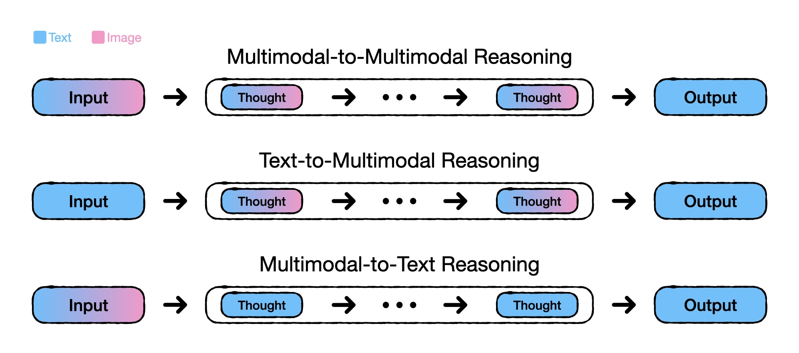
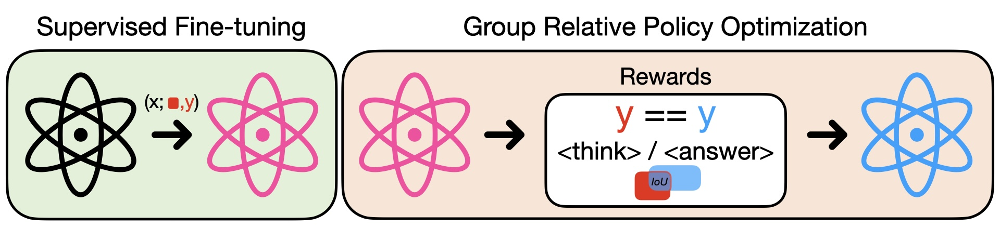

This repo contains the implementation of a project on multimodal reasoning. The technical report can be found [here](pdf/technical_report.pdf).

### 3 Paradigms of Multimodal Reasoning

  

- [Anole](Anole/) - contains the implementation of *Multimodal-to-Multimodal Reasoning*
- [SEED](SEED/) - contains the implementation of *Text-to-Multimodal Reasoning*
- [VLM-R1](VLM-R1/) - contains the implementation of *Multimodal-to-Text Reasoning*

### More on Multimodal-to-Text Reasoning

  

For further details of Multimodal-to-Text Reasoning implementation, refer to [here](VLM-R1/README.md).
