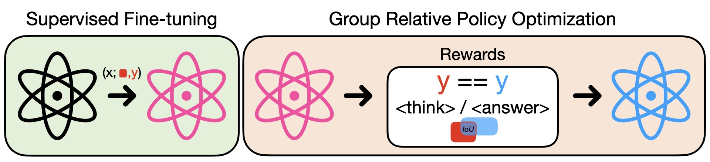

# Multimodal-to-Text Reasoning
This project contains the implementation of Multimodal-to-Text reasoning paradigm of [this](../pdf/technical_report.pdf) project.

<p align="center">
  
</p>

### Set-up
```bash
# set the environment variables as in `.env_example`
source setup.sh
```

### Datasets structure
```bash
📦 data
├── 📁 aokvqa
│   ├── 📁 images
│   ├── 📄 train.json
│   └── 📄 val.json
├── 📁 DrivingVQA
│   ├── 📄 test.json
│   └── 📄 train.json
├── 📁 images
├── 📁 scaleup
│   ├── 📁 data
│   └── 📁 images
├── 📁 scaleup_eval
│   └── 📁 eval
│       ├── 📁 gqa
│       ├── 📁 pope
│       ├── 📁 scienceqa
│       ├── 📁 textvqa
│       ├── 📁 vizwiz
│       └── 📁 vqav2
```

### Train/Eval code structure
```bash
📦 src/open_r1
├── 📁 config
├── 📁 eval     # evaluation code for aokvqa/drivingvqa/viscot
├── 📁 rewards  # rewards definition used in GRPO training
├── 📁 trainer  # GRPO implementation
├── 📁 utils
├── 📁 vlm_modules
├── 📄 grpo.py  # Training GRPO on aokvqa/drivingvqa datasets
├── 📄 grpo_scaleup.py  # Training GRPO on VisCOT
├── 📄 inference.py
├── 📄 merge_lora.py
├── 📄 prepare_sft_data.py  # Prepares SFT data format to train with LLlaMA-Factory (drivingvqa, aokvqa)
└── 📄 prepare_sft_data_scaleup.py  # Prepares SFT data format to train with LLlaMA-Factory (VisCOT)
```
